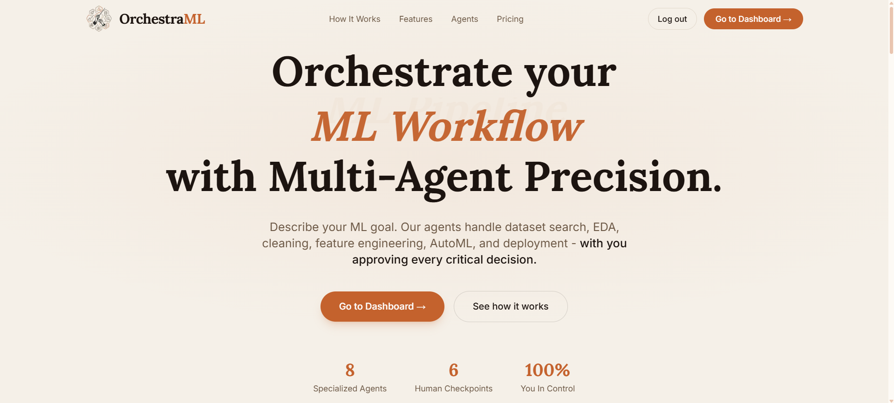
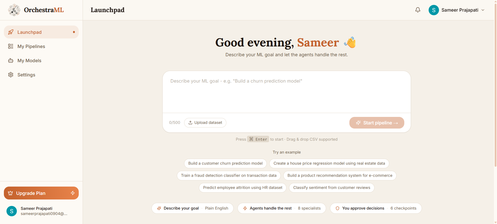
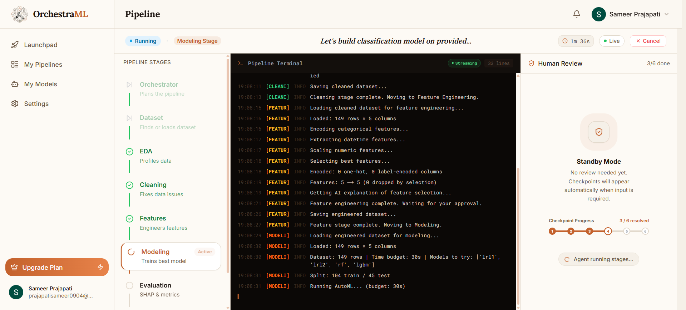
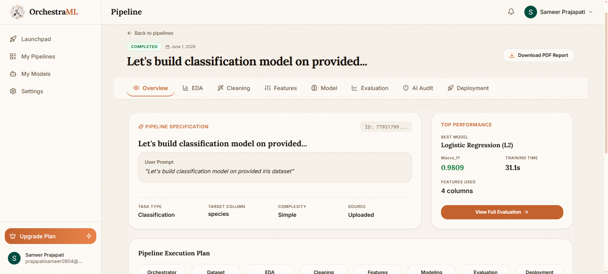
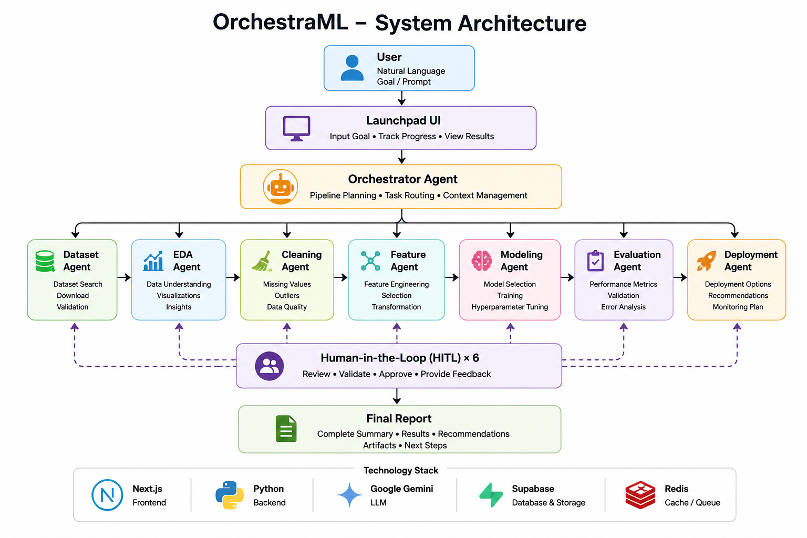
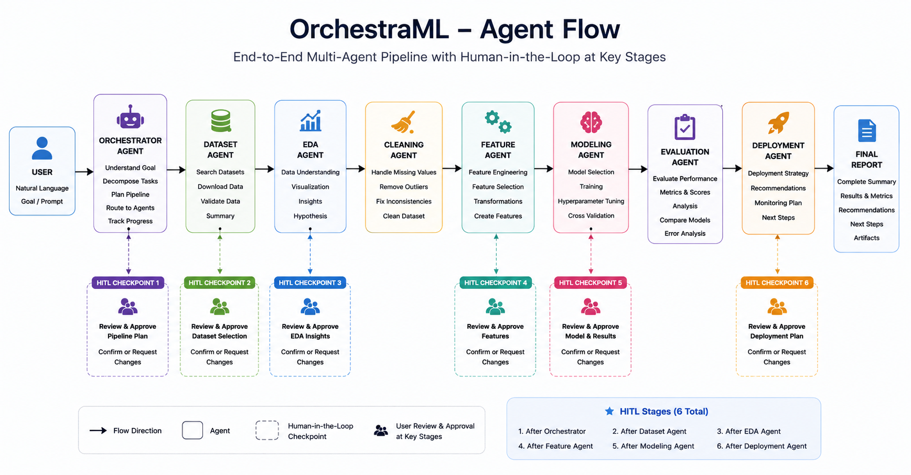
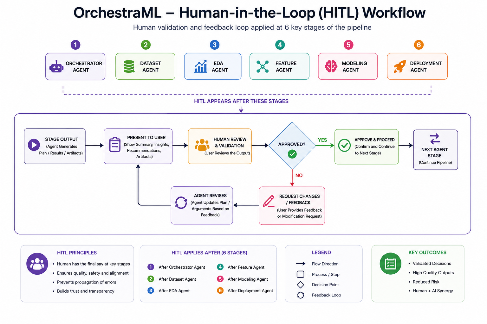

# OrchestraML

Multi-Agent Platform for Autonomous Machine Learning

## Overview

OrchestraML transforms natural language objectives into complete machine learning workflows through collaborative AI agents.

Users provide a goal such as:

> Build a customer churn prediction model

OrchestraML coordinates specialized agents to execute the ML lifecycle while keeping users involved through Human-in-the-Loop validation checkpoints.

---

## Screenshots

### Landing Page

Show the product entry experience and project positioning.



---

### Launchpad

Natural language → ML pipeline execution.



---

### Pipeline Execution

Multi-agent workflow with Human-in-the-Loop checkpoints.



---

### Final Report

Execution summary, metrics, recommendations and artifacts.



---

## Architecture

### System Architecture



### Agent Flow



### Human-in-the-Loop Workflow



---

## Features

* Natural language → ML pipeline
* Multi-agent orchestration
* Automated EDA
* Data cleaning
* Feature engineering
* Model training & evaluation
* Deployment recommendations
* Final execution reports
* Human-in-the-Loop approvals

---

## Guardrails & Controlled Execution

OrchestraML includes pre-execution guardrails to ensure that pipeline execution only begins for valid machine learning objectives.

Before orchestration starts, user requests pass through an input validation layer that classifies requests into:

* Valid pipeline requests → execution allowed
* Clarification required → request refinement
* Greetings or empty requests → rejected
* Out-of-scope requests → blocked

Invalid requests do not trigger orchestration and do not consume execution limits.

This controlled execution layer improves reliability, prevents unnecessary resource usage, and ensures that agent workflows remain aligned with user intent.

---

## Architecture (concept)

```text
User
 ↓
Orchestrator Agent
 ├── Dataset Agent
 ├── EDA Agent
 ├── Cleaning Agent
 ├── Feature Agent
 ├── Modeling Agent
 ├── Evaluation Agent
 └── Deployment Agent
```

---

## Demo Flow

1. Open Launchpad
2. Enter ML objective
3. Execute pipeline
4. Review HITL checkpoints
5. Generate final report

Example:

```txt
Build a customer churn prediction model
```

---

## Tech Stack

<!-- Badges added for a more professional appearance while keeping the original stack text -->

<p>
  
  
  
  
  
</p>

---

## Recognition

🏆 Ranked **#24 Product of the Day** on Product Hunt

Product Hunt:
https://www.producthunt.com/products/orchestraml/launches/orchestraml

---

## Course Inspiration

Built while exploring concepts from the Google × Kaggle 5-Day AI Agents Course.

---

## Demo Environment

The public deployment is optimized for stable demonstration and controlled execution.

Pipeline execution includes usage limits and resource management policies. If execution is interrupted, users can start a new pipeline or continue managing existing runs from the pipeline dashboard.

For a complete end-to-end walkthrough, please refer to the demo video.

---

## Runtime Note

The current showcase deployment processes one pipeline execution at a time to maintain stable execution and consistent user experience in the demonstration environment.

The underlying architecture is designed for future scalability and support for parallel execution through infrastructure upgrades.

---

## Repository Notice

This repository is a public showcase of OrchestraML.

The production implementation remains private while the platform continues development.

Included:

* Architecture
* Screenshots
* Documentation
* Demo

Source code for proprietary orchestration is not included.

---

## Roadmap

OrchestraML is an actively evolving platform.

The current version establishes the foundation for multi-agent machine learning workflows, Human-in-the-Loop execution, and controlled orchestration.

Future development will focus on:

* Advanced agent collaboration
* Enhanced guardrails and reliability
* Smarter orchestration and planning
* Improved deployment automation
* Better scalability and execution monitoring
* Richer user experience and collaboration features

The long-term vision is to make OrchestraML a production-ready AI platform for end-to-end machine learning automation.


---

## Links

Website: https://orchestra-ml.vercel.app
<br>
Video Demo: https://youtu.be/7_e1PIC01X4
